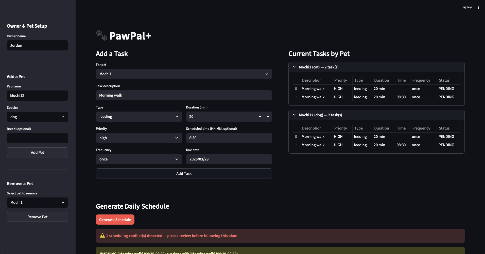

# PawPal+ (Module 2 Project)

You are building **PawPal+**, a Streamlit app that helps a pet owner plan care tasks for their pet.

## Scenario

A busy pet owner needs help staying consistent with pet care. They want an assistant that can:

- Track pet care tasks (walks, feeding, meds, enrichment, grooming, etc.)
- Consider constraints (time available, priority, owner preferences)
- Produce a daily plan and explain why it chose that plan

Your job is to design the system first (UML), then implement the logic in Python, then connect it to the Streamlit UI.

## What you will build

Your final app should:

- Let a user enter basic owner + pet info
- Let a user add/edit tasks (duration + priority at minimum)
- Generate a daily schedule/plan based on constraints and priorities
- Display the plan clearly (and ideally explain the reasoning)
- Include tests for the most important scheduling behaviors

## Getting started

### Setup

```bash
python -m venv .venv
source .venv/bin/activate  # Windows: .venv\Scripts\activate
pip install -r requirements.txt
```

### Suggested workflow

1. Read the scenario carefully and identify requirements and edge cases.
2. Draft a UML diagram (classes, attributes, methods, relationships).
3. Convert UML into Python class stubs (no logic yet).
4. Implement scheduling logic in small increments.
5. Add tests to verify key behaviors.
6. Connect your logic to the Streamlit UI in `app.py`.
7. Refine UML so it matches what you actually built.

### Testing PawPal+
`python -m pytest`
Confidence Level: 4 Stars
1. Pet Management — Owners can add, retrieve, and remove pets of any species without affecting one another.
2. Task Visibility — Tasks added to any pet are always fully visible and correctly isolated to their own pet.
3. Priority & Sorting — Tasks sort correctly by urgency and by scheduled time, with completed tasks excluded.
4. Conflict Detection — Overlapping or duplicate scheduled times are flagged; non-overlapping times are not.
5. Recurrence & Status — Recurring tasks spawn the correct next occurrence when completed; one-off tasks do not.

---

## 📸 Demo



---

## Features

### 🐕 Multi-Pet Management
Add and remove any number of pets, each with a name, species, breed, and birth date. Every pet maintains its own independent task list — tasks never bleed across pets.

### ✅ Task Tracking with Status Transitions
Each task moves through four states: **Pending → In Progress → Completed / Skipped**. The scheduler only surfaces pending and in-progress tasks in the daily plan, so completed work automatically falls out of view.

### 🔢 Priority-Based Sorting
Tasks are ranked across four levels: **Low, Medium, High, Urgent**. The scheduler always surfaces the most urgent work first. Within each pet's task panel, tasks are displayed sorted by priority so nothing critical gets buried.

### 🕐 Chronological Time Sorting
Tasks with a scheduled time (`HH:MM`) are sorted chronologically using an O(n log n) sentinel-value sort. Untimed tasks are appended after all timed tasks, ordered by priority. This produces a clean, time-first daily plan.

### ⚠️ Conflict Detection
When two tasks' time windows overlap — including exact duplicate start times — the scheduler flags each pair with a human-readable warning showing both task names and their start-to-end ranges. Detection runs in O(n log n + k) time by sorting once and breaking the inner loop early when no further overlap is possible.

### 🔁 Recurring Task Recurrence
Tasks can repeat on a **Daily, Weekly, or Monthly** frequency. When a recurring task is marked complete, a new pending copy is automatically created with the correct next due date — daily tasks roll forward one day, weekly by seven days, monthly by thirty. One-off tasks do not recur.

### 🗓️ Daily Schedule Generation
The `schedule()` method builds a single ordered list: timed pending tasks in chronological order, followed by untimed pending tasks in priority order. This gives owners a clear, actionable plan for the day.

### 🔍 Filtering by Pet and Status
Tasks can be filtered by pet name, status, or both simultaneously. This powers features like "show me only Mochi's pending tasks" without touching any other pet's data.

### 📅 Care Plans
Owners can create named `Plan` objects that group pets together by ID for a defined date range, then retrieve all tasks across those pets in a single call.

### 🕰️ Availability Windows
Owners can record time constraints per day of the week (e.g., available Monday 09:00–17:00). Each window exposes an `is_available()` check for a given time.

---

## How to Use

1. **Add a pet** — enter a name and species in the sidebar, then click **Add Pet**.
2. **Add tasks** — fill in the task form on the left: description, type, priority, duration, optional scheduled time, frequency, and due date. Click **Add Task**.
3. **Review tasks** — the right panel shows each pet's tasks sorted by priority.
4. **Generate a schedule** — click **Generate Schedule** at the bottom. Conflict warnings appear in amber banners above the daily plan table. A green banner confirms a clean schedule.
5. **Remove a pet** — use the remove dropdown in the sidebar. All of that pet's tasks are removed from the schedule automatically.

---

## Project Structure

```
pawpal_system.py              # All backend classes and scheduling logic
app.py                        # Streamlit UI
uml.mmd                       # Final Mermaid class diagram
test_multi_species_pets.py    # Full test suite (133 tests, 100% coverage)
reflection.md                 # Design journal and AI collaboration notes
```