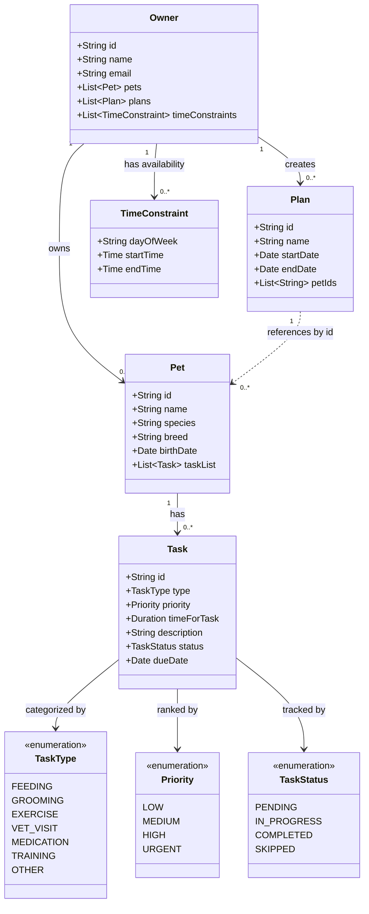

# PawPal+ Project Reflection

## 1. System Design
- Three core actions a user should be able to perform:
  - Add a pet to the list
  - Allow the pet owner to mark tasks as done per pet
  - Allow the pet owner to schedule times when tasks can be completed

- Main objects needed for the system:
  - Owner
    - Pet(s)
    - Time Constraints
    - Plan(s)
  - Pet
    - Tasks List
  - Tasks
    - Type
    - Priority
    - Time for task
  - Plan(s)
    - Owner
    
**a. Initial design**

- Briefly describe your initial UML design.
  - The initial UML design was based on a productive discussion with Claude AI that was initially provided with the `Main objects needed for the system` from above. It then went through a few iterations to drill down and find a UML that makes sense for this scenario. 
- What classes did you include, and what responsibilities did you assign to each?
  - The initial discussion with Claude AI was provided with the following classes: 
    - owner
    - pet
    - tasks
    - plan(s)
  - Through a discussion about the application and some back and forth on the UML design revealed a better structure that makes sense. The finalized list of classes is: 
    - owner
    - plan
    - pet
    - task
    - timeconstraint
    - tasktype
    - priority
    - taskstatus
    

**b. Design changes**

- Did your design change during implementation?
  - Yes, during the discussion with Claude the design changed by better refining the connections between classes.
- If yes, describe at least one change and why you made it.
  - The major change was to no longer provide a list of Pet classes to the Plan class, but rather provide it only the list of `pet_ids`. This requires it to now look up all of the owners pets to find the plans. 

---

## 2. Scheduling Logic and Tradeoffs

**a. Constraints and priorities**

- What constraints does your scheduler consider (for example: time, priority, preferences)?
- How did you decide which constraints mattered most?

**b. Tradeoffs**

- Describe one tradeoff your scheduler makes.
- Why is that tradeoff reasonable for this scenario?

---

## 3. AI Collaboration

**a. How you used AI**

- How did you use AI tools during this project (for example: design brainstorming, debugging, refactoring)?
- What kinds of prompts or questions were most helpful?

**b. Judgment and verification**

- Describe one moment where you did not accept an AI suggestion as-is.
- How did you evaluate or verify what the AI suggested?

---

## 4. Testing and Verification

**a. What you tested**

- What behaviors did you test?
- Why were these tests important?

**b. Confidence**

- How confident are you that your scheduler works correctly?
- What edge cases would you test next if you had more time?

---

## 5. Reflection

**a. What went well**

- What part of this project are you most satisfied with?

**b. What you would improve**

- If you had another iteration, what would you improve or redesign?

**c. Key takeaway**

- What is one important thing you learned about designing systems or working with AI on this project?
